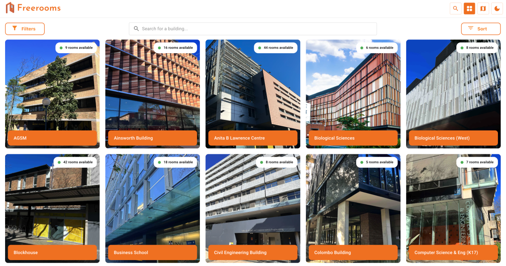
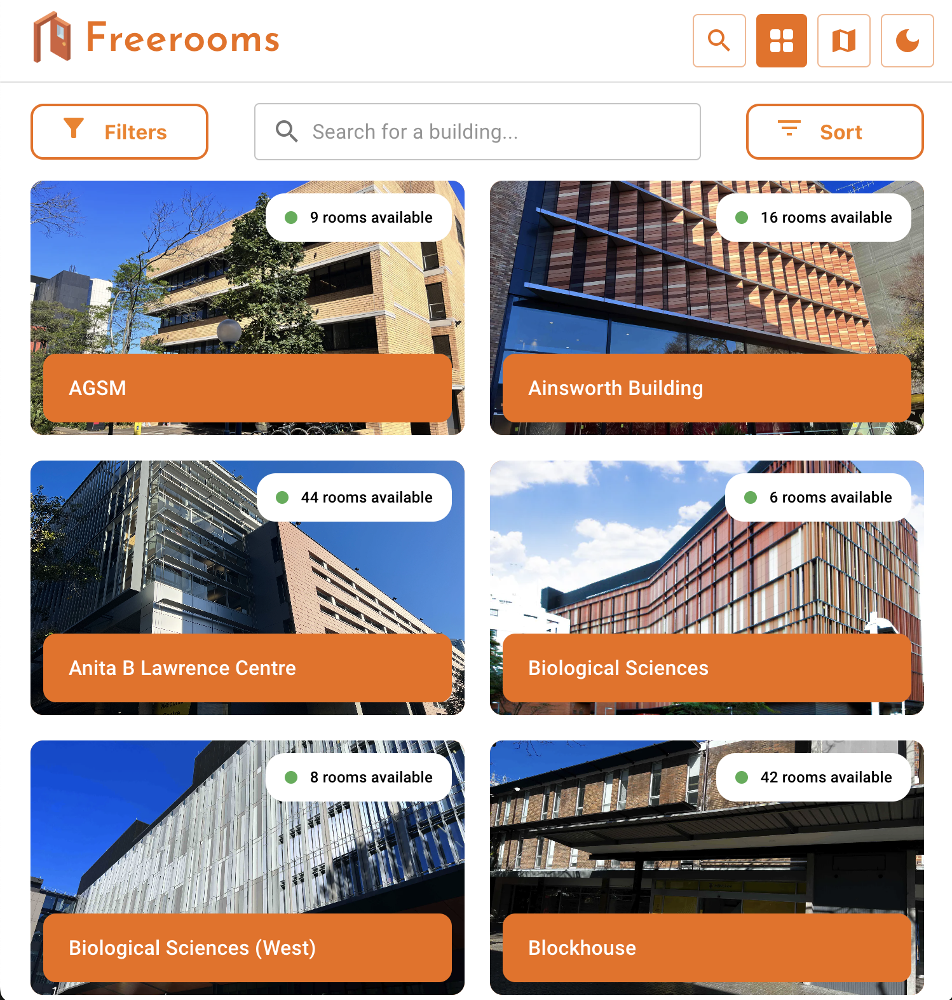
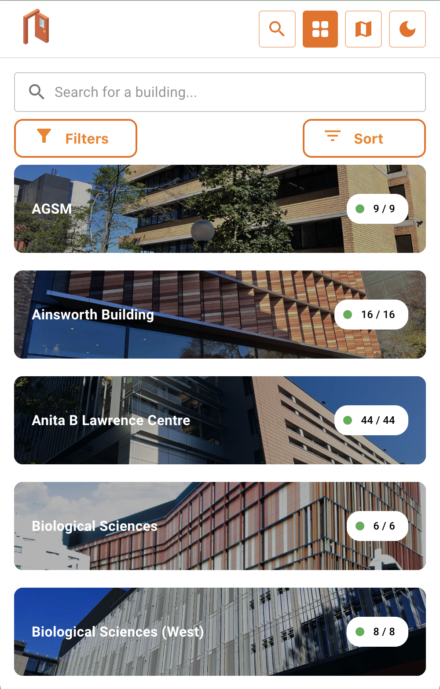

> This question is relevant for **any project with a backend**
> (Bridges, Chaos, Circles, Clusters, Unielectives, Freerooms, Notangles).

# DevSoc Subcommittee Recruitment: Frontend
> **YOU DO NOT NEED TO COMPLETE ALL PARTS.** 
> Complete the parts that you think best reflect your skills (feel free to do any order).

## Overview and Expectations

- You will be given an image of a website. **Your goal is to recreate this image as a page**.
- You can (and we would prefer) that you implement your solution in this directory, though you may choose to create your own repository
- This is a qualitative technical assessment that will be reviewed by Project Directors to make a judgment on progressing your application to an interview.
- There are no exact marks associated with the completion of individual components. Your code will be judged on its structure, style and adherence to frontend conventions to create a visually similar product to the specified goal.
- This technical task is **not compulsory**. You may judge the relevance of this task to the project and role you are applying for.
  - We will be making a judgement based on your holistic application which includes your application answers and may include either or both this and the backend task.

## Tasks



An image of the [Freerooms](https://freerooms.devsoc.app/) site is provided above.

### Main Task

The goal of this part is for you to demonstrate your HTML, CSS and JS/TS skills. Please recreate this image in a frontend environment.

You are given the freedom to choose how you recreate this.

- You may decide to use a single `.html` file.
- You can also use any frontend framework or library as the foundation of your page.
  - These include but are not limited to `React`, `Angular`, `Vue` as well as `Next.js` or `Gatsby.js`.
- The search bar and sort by dropdown do not need to work.
- Obviously matching every stylistic aspect of this page may be difficult and time-consuming. Prioritise large elements and structural features before you try to recreate finer details.
- You do not need to find exact matches for the fonts, icons or logos.
- You do not need to aim for perfection. Please only complete as much of this exercise as you wish focusing on demonstrating the breadth of your frontend knowledge. There is no requirement for perfection or pixel-precise matching.
- For the base implementation you do not need to account for responsive design (although you may want to try that for stretch task 2).

The sample data shown in the image is provided both in the `data.json` file and below in the [Appendix](#appendix) in `JSON` format.

The [Freerooms](./assets/freeroomsLogo.png) icon has been provided as a `png`. The photos of the buildings have also been provided in the [assets](./assets/) folder. The rest of the assets are taken from a library which has been provided below for your convenience.

- Navbar: [Google Fonts](https://fonts.google.com/icons), from top to bottom:
  - [Freerooms](./assets/freeroomsLogo.png)
  - Search
  - Map
  - Grid View
  - Dark Mode

- Filter and sort
  - Filter Alt
  - Filter List

### Stretch Task 1
The goal of this part is for you to demonstrate component state management. When you click on the Freerooms logo, if it is closed, 'open' the door, and if it is open, 'close' the door.

The open and close door versions of the logo are in [assets](./assets/) folder.

### Stretch Task 2
For this task, ensure that your site is fully **responsive** across various screen sizes and desktop views. All elements should adjust dynamically while maintaining a visually appealing layout.

For extreme layouts, you have the option to redesign certain views to better fit the screen dimensions. You can take inspiration from the current layout of Freerooms, but feel free to adjust the design as you see fit.




## Submission

Please submit the link to your fork of the repo in the application form. You may choose to implement your solution in a separate, fresh repository. If so, please share the link to this repository within `instructions.txt`.

If your solution is not accessible through an `index.html` file or run via a standard `npm i` `npm run start` command, please fill out `instructions.txt` with instructions on how we can open your solution in our browser and any dependencies that we may need.

## Additional comment

Whilst most of our frontend applicants tend to have frontend experience, either through self-study, work or COMP6080, we are open to candidates of varying experiences and abilities. The most important characteristics are one's curiosity and willingness to self-teach/learn. We have had frontend members join with little prior experience and go on to learn and contribute significantly. Therefore, if you find a lot of these exercises difficult, do not be disheartened - please make an attempt.

## Appendix

```json
[
    {
      "name": "AGSM",
      "rooms_available": 9,
      "building_file": "./agsm.webp"
    },
    {
      "name": "Ainsworth Building",
      "rooms_available": 16,
      "building_picture": "./ainsworth.webp"
    },
    {
      "name": "Anita B Lawrence Centre",
      "rooms_available": 44,
      "building_picture": "./anitb.webp"
    },
    {
      "name": "Biological Sciences",
      "rooms_available": 6,
      "building_picture": "./biologicalScience.webp"
    },
    {
      "name": "Biological Science (West)",
      "rooms_available": 8,
      "building_picture": "biologicalScienceWest.webp"
    },
    {
      "name": "Blockhouse",
      "rooms_available": 42,
      "building_picture": "./blockhouse.webp"
    },
    {
      "name": "Business School",
      "rooms_available": 18,
      "building_picture": "./businessSchool.webp"
    },
    {
      "name": "Civil Engineering Building",
      "rooms_available": 8,
      "building_picture": "./civilBuilding.webp"
    },
    {
      "name": "Colombo Building",
      "rooms_available": 5,
      "building_picture": "./colombo.webp"
    },
    {
      "name": "Computer Science & Eng (K17)",
      "rooms_available": 7,
      "building_picture": "./cseBuilding.webp"
    }
  ]
```
